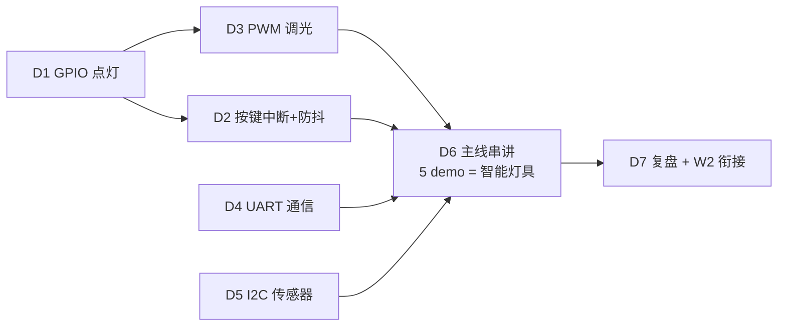

# W1 · 嵌入式手感唤醒（Wokwi 仿真）

> 来源：`Atlas/tech-plans/4week-awakening.md` 周计划 · 优化版（2026-08-03）
> 方式：纯仿真，零硬件（Wokwi 浏览器）
> 目标：唤醒嵌入式手感（GPIO/中断/PWM/UART/I2C），5 个 demo 拼装 = 智能灯具雏形

## 🗺️ 学习地图（知识依赖）



- **主线**：D1 → D2/D3（输入/输出控制）→ D4/D5（通信）→ D6 串讲 → D7 复盘
- D4/D5 可并行；D2 之前先过 D1（GPIO 基础）

## 任务表

| 天 | 任务 | 目录 | 验证标准 | 状态 |
|----|------|------|----------|------|
| D1 | ESP32 LED 闪烁 | `D1-blink/` | 编译通过，仿真运行 | ✅ 材料就绪（lint 验证过） |
| D2 | 按键中断 + 防抖 | `D2-interrupt/` | 串口打印正确，无抖动误触发 | ✅ 材料就绪 |
| D3 | PWM 调光（呼吸灯） | `D3-pwm/` | 逻辑分析仪看到占空比变化 | ✅ 材料就绪 |
| D4 | UART 双实例互发（loopback） | `D4-uart/` | 串口 MATCH 循环 | ✅ 材料就绪 |
| D5 | I2C 读 MPU6050 | `D5-i2c/` | 读到加速度/温度实时值 | ✅ 材料就绪 |
| D6 | 主线串讲（智能灯具雏形） | `D6-review/` | 能讲 3 分钟 + 15 题自测 | ✅ 材料就绪 |
| D7 | 复盘 + W2 衔接 | `D7-review/` | 复盘笔记 + W2 前置清单 | ✅ 材料就绪 |

## 每日节奏

1. 打开对应 D 目录的 `README.md`（目标 + 步骤 + 概念速记 + 面试题 + 组合挑战）
2. Wokwi 粘贴 `sketch.ino` + `diagram.json`（+ `libraries.txt`），点 ▶ 跑通
3. 验证标准打勾；面试题口头答一遍
4. 完成状态告诉 Agent → 更新本表

## 学习飞轮（跑通代码之后）

> 会跑代码只是第一层。每个 D 走一次飞轮，把「会跑」变成「能设计」。

```
① 跑代码（训练包）          → 动手
② 读 understand.md（理解包）→ 先自答引导问题，再看答案（主动回忆）
③ 写「我的理解」3 句         → notes/YYYY-MM-DD-Dn.md（异步对话，Agent 下次回复追问）
④ 填架构图空格              → architecture/00-system-overview.md（留白格）
⑤ 概念卡入库               → 每 D 沉淀一张 study-vault 格式卡（W1 完自动成库）
```

- 理解包位置：`{D}/understand.md`（三层阅读：一句话/详细/深挖）
- 架构骨架：`architecture/00-system-overview.md` + `architecture/ADR.md`（设计决策记录）
- 时间预算：飞轮每步 5-10 分钟，共约 30 分钟/D

## 掌握度看板

| D | 跑通 ✅ | 理解 🔵 | 架构 🟢 | 迁移 🟣 |
|---|--------|---------|---------|---------|
| D1 | 已跑通 | 待读理解包 | 控制层已标 | 待写 |
| D2 | 待跑 | 待读 | 感知层待填 | 待写 |
| D3 | 待跑 | 待读 | 控制层核心待填 | 待写 |
| D4 | 待跑 | 待读 | 通信层待填 | 待写 |
| D5 | 待跑 | 待读 | 感知层待填 | 待写 |
| D6 | 待跑 | 串讲 | 全图回顾 | 自测 |
| D7 | 复盘 | 复盘 | W2 衔接 | 复盘 |

> 每完成一项，Agent 更新看板（用户确认）

## 质量保障

- 所有 `diagram.json` 交付前经官方 linter 验证（`Forge/scripts/wokwi-lint/`），0 error
- 已抓并修复 2 处引脚名错误（esp:2→D2、逻辑分析仪 0→D0、按钮 1/2→1.l/2.l）

## 产出约定

- 代码 + 电路 + 说明 → 各 D 目录
- 每天收获 → `notes/YYYY-MM-DD-Dn.md`
- 复盘 → `notes/W1-review.md`
- W1 完成后：概念卡批量入库 study-vault 复习体系

## 里程碑

- [ ] W1 完成：GPIO/PWM/UART/I2C 手感恢复（→ W2 Modbus 主从）
