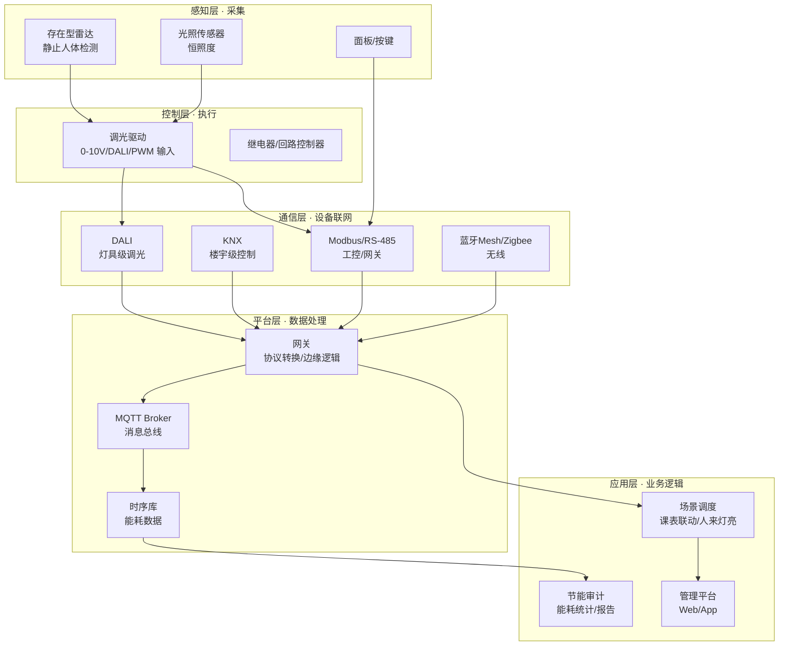

# 智能照明系统架构 · v0 总图（学习飞轮 · 方案 2）

> 定位：W1-W4 学习的"架构认知骨架"。先看懂全局，再每完成一个 D 填一格。
> 演进规则：🟡 = 留白待填（对应学习任务）｜✅ = 已填
> 配套：`../README.md` 学习飞轮｜`ADR.md` 设计决策记录｜课纲 `../../../Atlas/plan/courses.md`｜计划源 `../../../Atlas/tech-plans/4week-awakening.md`

## 一、五层架构总图

**核心认知**：智能照明 = 感知（采数据）+ 控制（执行调光）+ 通信（联网）+ 平台（数据/逻辑）+ 应用（业务）。W1-W4 就是从底层往上爬：W1 摸透控制层和感知层的"手感"，W2 打通通信层，W3 深挖调光驱动，W4 组装平台层+应用层。

## 二、W1 demo ↔ 架构位置映射

| D | demo | 架构层 | 说明 |
|---|------|--------|------|
| D1 | GPIO 点灯 | 控制层 | "灯亮/灭"的最基本执行单元。LED = 一盏灯的抽象 |
| D2 | 按键中断 | 感知层 + 控制逻辑 | 输入设备接入 + 事件驱动处理 |
| D3 | PWM 调光 | 控制层（核心） | 调光驱动的底层机制，W3 深挖上层协议 |
| D4 | UART | 通信层 | 点对点链路——Modbus 的物理基础 |
| D5 | I2C 传感器 | 感知层 | 传感器数据采集，恒照度/人感的前提 |

## 三、留白格（每完成一个 D 填一格）

| 空格 | 内容 | 填格条件 | 状态 |
|------|------|----------|------|
| S2 | 恒照度闭环：光照传感器 → 调光驱动的反馈链路怎么设计？ | D3+D5 完成后 | 🟡 |
| C3 | Modbus/RS-485 为什么是网关首选协议？（可靠性/布线/成本） | W2 完成后 | 🟡 |
| C1 | DALI vs 0-10V vs 蓝牙Mesh 选型逻辑（三选一表格） | W3 完成后 | 🟡 |
| P1 | 网关职责清单：协议转换/边缘规则/断网容错 | W2+W4 完成后 | 🟡 |
| 应用层 | 一个真实场景（教室）的完整架构图 + 选型 | W4 完成后 | 🟡 |

## 四、架构理解自检（每 D 问自己）

1. 这个机制在系统图里属于哪一层？和上下层怎么协作？
2. 如果它坏了，影响范围多大？（故障域思维——架构师第一课）
3. 换一种方案做同一件事，代价是什么？（选型思维）

---

> v0 日期：2026-08-03｜后续每完成一个 D，更新此文件（Agent 执行，用户确认）
